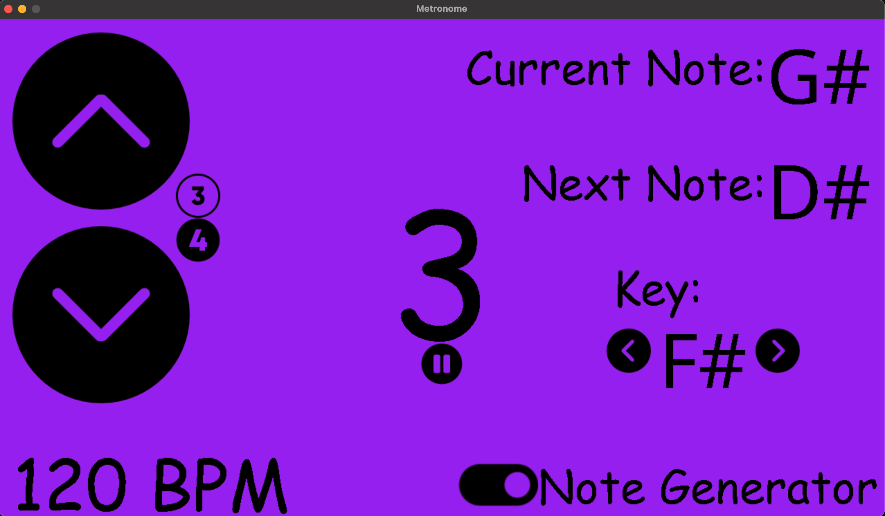

# metronome
This is a metronome with a random note generator. 
I made this because I wanted to practice the notes of a guitar, and I couldn't find a good version of a metronome with random notes.
The note sounds are from the piano in [Logic](https://www.apple.com/logic-pro/). 

Also, I thought a click sound was kind of boring, so there's a simple beat playing at tempo instead.
You can also turn note generation on and off, and pick 3/4 or 4/4 as time signiture.


## Running
The only dependency is pygame.
To run, download source, and make sure you have pygame installed. 

```bash
pip install pygame
```

Then run:

```bash
python main.py
```

## UI


I kept the default purple from pygame. Also Comic Sans is low key :fire:

## Installer
if you want to have like an app or whatever, make sure you have pyinstaller, and then run the install script

```bash
pip install pyinstaller
cd installer
./installer.sh
```

The app should be there under a folder called dist.


___

images from flaticon.com
